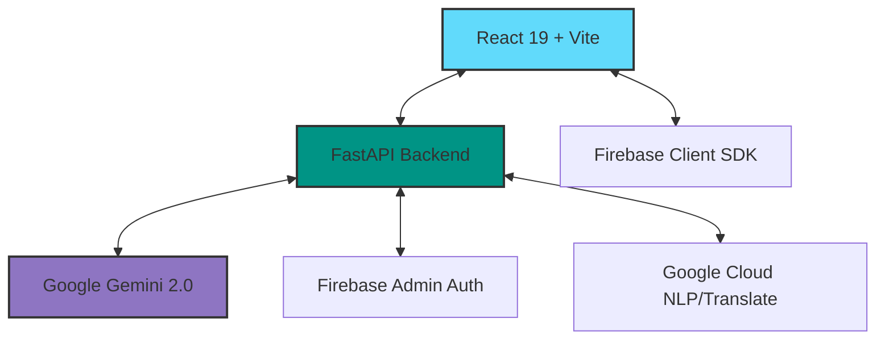

# 🗳️ ElecTech: AI-First Election Assistant

[](https://fastapi.tiangolo.com/)
[](https://reactjs.org/)
[](https://deepmind.google/technologies/gemini/)
[](https://firebase.google.com/)

> **Empowering citizens through AI-driven electoral education.** ElecTech is a sophisticated, AI-powered platform designed to simplify the voting journey for Indian citizens, providing personalized guidance based on official ECI standards.

---

## 🌟 Core Experience

ElecTech transforms the complex electoral process into a seamless, interactive journey. By leveraging Google's **Gemini 2.0 Flash**, we provide:

- **🗺️ Personalized Journey**: A step-by-step roadmap tailored to your registration status and location.
- **🤖 Multilingual AI Chat**: Real-time support in 22+ Indian languages using Google Cloud Translation.
- **📊 Readiness Score**: Dynamic assessment of your voting preparedness with smart checklists.
- **⚡ Scenario Simulator**: Interactive "What if" simulations to prepare for any polling day situation.
- **📅 Smart Timeline**: Automated election countdowns and critical deadline tracking.
- **🎯 Educational Quizzes**: AI-generated quizzes to boost electoral literacy.

---

## 🏗️ Technical Architecture



### Modern Engineering Principles
- **Asynchronous Processing**: Non-blocking AI operations using FastAPI's `async/await`.
- **Stateless Authentication**: Secure Firebase-backed JWT verification.
- **Resilient AI Pipeline**: Multi-prompt strategy with fallback logic for high availability.
- **Modular Components**: React 19 architecture with Tailwind CSS 4 for performance.

---

## 🛠️ Performance & Security

| Layer | Technology | Security/Performance Metric |
| :--- | :--- | :--- |
| **Frontend** | React 19 + Framer Motion | 60FPS Micro-animations, Lazy-loading |
| **Backend** | FastAPI (Python) | Pydantic validation, Async execution |
| **Auth** | Firebase Identity | OAuth 2.0, Secure Session Management |
| **Styling** | Tailwind CSS 4 | Zero-runtime CSS, Optimized bundle size |
| **AI Engine** | Gemini 2.0 Flash | Low-latency response, Contextual awareness |

---

## 🚀 Getting Started

### Prerequisites
- Python 3.10+
- Node.js 18+
- Google Cloud / Firebase Project

### 1. Server Setup
```bash
cd server
python -m venv venv
source venv/bin/activate # or venv\Scripts\activate on Windows
pip install -r requirements.txt
python main.py
```

### 2. Client Setup
```bash
cd client
npm install
npm run dev
```

### Environment Configuration
Ensure your `.env` files are configured with the following keys:
- `GEMINI_API_KEY`
- `FIREBASE_PROJECT_ID`
- `GOOGLE_APPLICATION_CREDENTIALS` (Path to JSON)

---

## 📜 Vision & Impact

ElecTech was built for the **Google Cloud VirtualPromptWar** hackathon. Our mission is to bridge the information gap in democracy using state-of-the-art AI, making the voting process transparent, accessible, and engaging for the next billion voters.

**#BuiltWithGemini #GoogleCloud #Election2024 #CivicTech**
