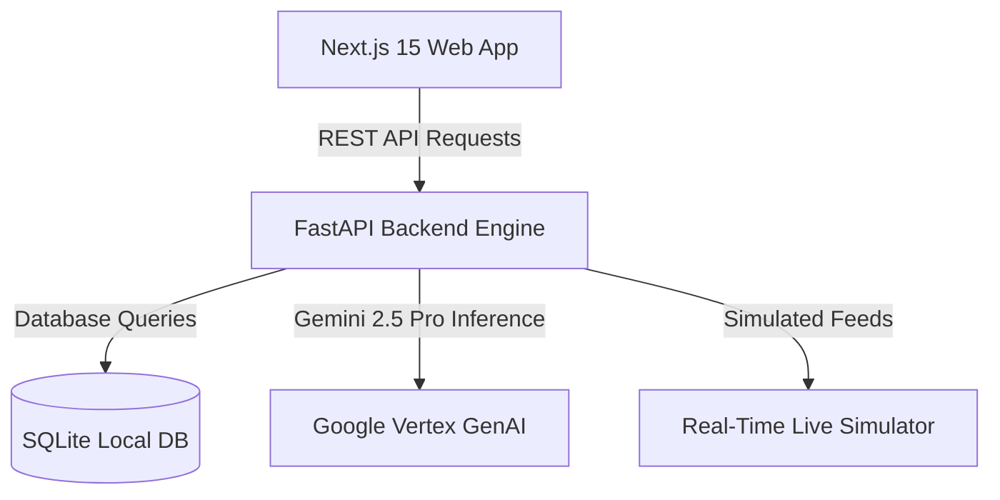
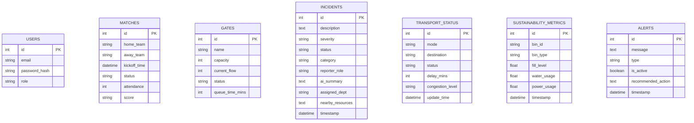

# StadiumMind AI – GenAI-Powered Smart Stadium Operations Platform for FIFA World Cup 2026

StadiumMind AI is an enterprise-grade, cloud-native smart stadium operations platform designed to enhance the spectator experience and maximize venue management efficiency during the **FIFA World Cup 2026**.

The platform features an **AI Operations Copilot** that proactively monitors simulated crowd telemetry, ticket scans, and transit arrival lines, triggering real-time recommendations (like spectator rerouting and volunteer reallocations) directly on the supervisor dashboards.

---

## System Architecture

The application is structured as a modern monorepo:



---

## Entity Relationship Diagram (ERD)



---

## Core GenAI Features (Gemini 2.5 Pro Powered)

1. **AI Operations Copilot**: Scans database telemetry to forecast gate choke-points, automatically generating warning alerts with actionable redirect paths.
2. **Vertex AI Search & RAG Chat**: Restricts stadium rules/guidelines to verified documents, avoiding hallucination and offering accessible navigation answers (e.g. companion seats, lifts).
3. **AI Incident Summarizer**: Analyzes raw spectator/volunteer hazard reports and classifies severity, department, and closest first-aid or cleanup gear.
4. **AI Multilingual Broadcasts**: Translates urgent notifications into English, Spanish, French, Arabic, and Portuguese with a single click.
5. **AI Executive Summary Reports**: Generates end-of-shift markdown briefs summarizing operations and waste stats for venue directors.

---

## Setup & Running Guide

### Prerequisites
- Node.js v20+ & npm
- Python 3.12+

### 1. Launch FastAPI Backend
```bash
cd services/api
# Virtual env is already initialized
.\.venv\Scripts\activate
pip install -r requirements.txt
uvicorn app.main:app --reload --port 8000
```
*API will run at `http://localhost:8000`. Database automatically seeds on startup.*

### 2. Launch Next.js Frontend
```bash
cd apps/web
npm install --legacy-peer-deps
npm run dev
```
*Frontend will run at `http://localhost:3000`.*

### 3. Running Backend Tests
```bash
.\services\api\.venv\Scripts\pytest.exe .\tests\test_backend.py
```
