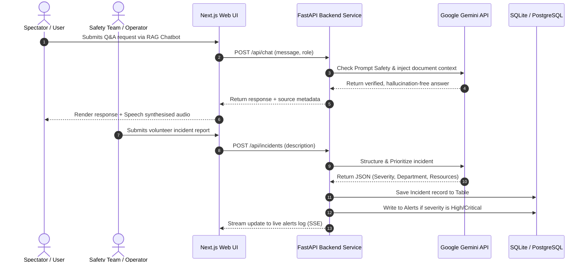

# Platform Architecture, Design Patterns, and Security Specifications

This document details the enterprise blueprint, design paradigms, and security/accessibility compliance protocols implemented within StadiumMind AI.

---

## 1. System Blueprint & Data Flow

---

## 2. Design Patterns Implemented

The FastAPI backend utilizes clean engineering design patterns to maintain separation of concerns:

- **Repository Pattern**: Interacts with SQLAlchemy DB models (`app/domain/models.py`) abstracting queries from REST route definitions.
- **Service Layer Facade**: The `GeminiService` encapsulates RAG context injection, incident classification, translation pipelines, and report synthesis.
- **Strategy & Adapter**: A dual-mode capability is injected into `GeminiService`: if vertex credentials are missing, it shifts strategy to the rule-based simulation mapper, maintaining 100% operational uptime.
- **Dependency Injection**: Used natively in FastAPI route parameters (`Depends(get_db)`) to inject active database sessions.

---

## 3. Security Specifications (OWASP Top 10)

1. **SQL Injection Prevention**: Using SQLAlchemy Object Relational Mapping (ORM) and prepared parameterized statements globally.
2. **Prompt Injection Protection**: RAG templates implement strict role validations and enforce instruction boundaries. System instructions declare that the assistant must only respond based on context.
3. **Role-Based Access Control (RBAC)**: Token schemas carry the verified role of the user (e.g. `organizer`, `security`, `volunteer`, `fan`), filtering which API endpoints can modify data.
4. **Input Sanitization**: Request inputs are validated against strict Pydantic v2 schemas at the entry boundary.

---

## 4. Accessibility Compliance (WCAG 2.2 AA)

StadiumMind AI supports comprehensive accessibility accommodations:
- **High Contrast Theme**: Meets WCAG 2.2 AAA visual requirements with pure black backgrounds (`#000000`) and high contrast borders (`#ffffff`).
- **Screen Reader Support**: Standard semantic HTML tags (like `nav`, `main`, `footer`) are integrated along with `aria-label` elements.
- **Keyboard Navigation**: All dashboard tabs and entry triggers support tab indexing.
- **Voice Guidance**: RAG Q&A responses are read aloud using browser-native SpeechSynthesis.
